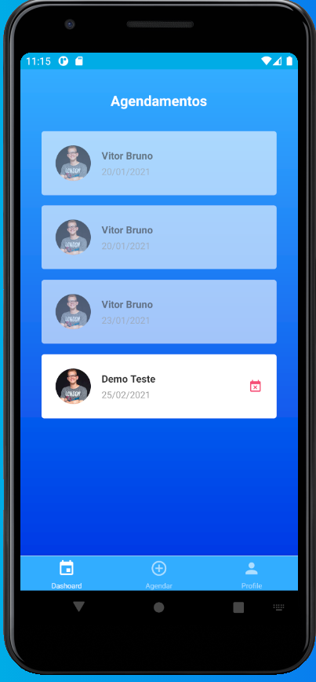
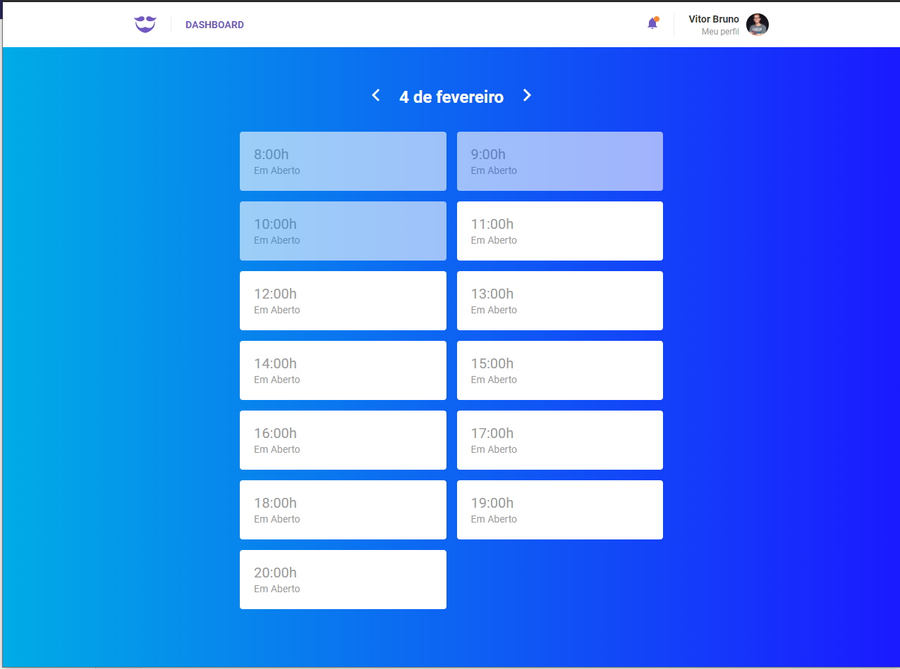

<h3 align="center">
  :rocket:  GoBarber
</h3>

## Projeto
GoBarber é um projeto do curso da RocketSeat. Tem como objetivo a criação de uma aplicação para a gestão de um salão de beleza. Nesse projeto foram desenvolvidos uma API em Node, uma aplicação web em React e uma aplicativo Mobile em react-native. Reformulado para React 17+ e React-Native 0.63+

## Screenshots
<h1 align="center">
  
  
  
  
</h1>

### Running

### Algumas __features__
* Agendamento de clientes com prestadores de serviços
* Envio de email de cancelamento de um agendamento
* Sistema de notificação para os prestadores de serviços informando sobre os novos agendamentos.
* Horários disponíveis de um prestador de serviço.
* Autenticação (JWT) de clientes e prestadores de serviços.
* Upload de avatar

### Algumas tecnologias utilizadas:
* Sistema de notificações com MongoDB
* Envio de email usando Filas com Redis
* Error Tracking com Sentry
* PostgresQL
* Express
* BeeQueue
